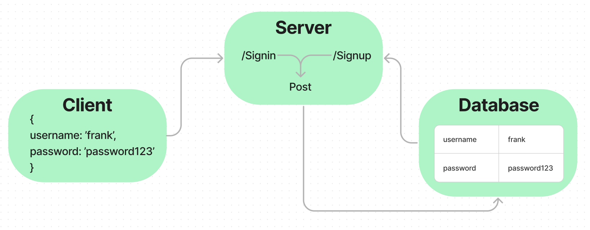

# basic-auth

401d53 Lab 6 basic auth.  
basic-auth
401d53 Lab 3 basic auth

## Project: Basic api server

### Author: Justin Mathieu

## Problem Domain

Practice with basic server routing and testing.

## Links and Resources

- [GitHub Actions](https://github.com/Justin-Mathieu/basic-auth/actions)
- [back-end prod url](https://basic-auth-dn1u.onrender.com)

## Collaborators

401d53 and 401d10 Used demo code as permitted.

## Setup

- Port variable
- Connection string for database.

## How to initialize/run your application (where applicable)

- Clone repo
- Run npm i in terminal
- Run nodemon in terminal

## Routes

POST: /signin - Authenicates user with password.

POST : /signup - Creates user in database.

## Tests

Run the command npm test with dependencies installed.

## UML

