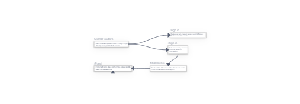

# basic-auth

401n21 Lab 6-8

## Requirements

- Port number in .env file.
-conection string in .env

## Running App

- npm start  

## UML

### **Notes**

- Work in progress.
- Still deploy to heroku and write tests.
- Need to make UML.
